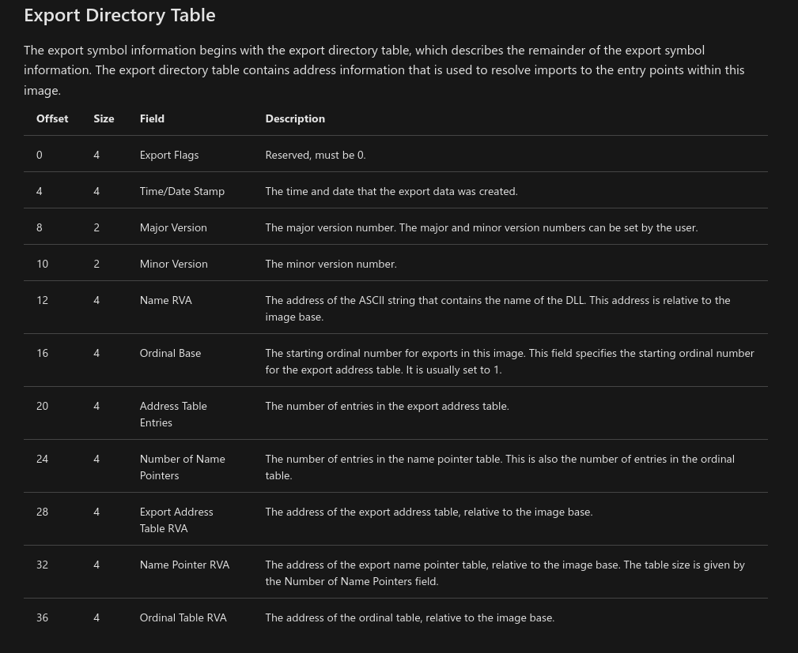

# Windows API hashing - Part 1

## Theory
IAT (Import Address Table) is a table of user-space modules.It basically contains all the address of the modules running on windows. Hence for a EXE an IAT stores thre address of functions imported by DLL.

## Issue for Malwares!
If a .exe has IAT in its place it becomes very easy to guess the fuction's behaviour by just reading the function name. For instance, if a malware uses VirtualAlloc then it cleary means it is allocation memory in current process.

So basically when you just load a PE on any parser tool it will read PE's IAT table and try to figure out the methods imported from DLL and the exact thing we want to hide. We dont want anyone to know the methods used by PE just by looking at its IAT table.

So first we need to look up on our own hashing algorithm.
Code:
```c#
using System;
using System.Security.Cryptography;
using System.Runtime.InteropServices;

class Program
{
    public static String CalculateHash(String functionName)
    {
        string hash="";
        char[] fnc = functionName.ToCharArray();
        var sourceBytes = System.Text.Encoding.UTF8.GetBytes(fnc);
        for (int i = 0; i < fnc.Length; i++)
        {
            var h = MD5.Create().ComputeHash(sourceBytes, i, 1);
            hash = hash + BitConverter.ToString(h).Replace("-","");            
        }
        byte[] final_hash = System.Text.Encoding.UTF8.GetBytes(hash);
        var t = MD5.Create().ComputeHash(final_hash);
        return BitConverter.ToString(t).Replace("-","");
    }
    static void Main()
    {
        String hash = CalculateHash("CreateThread");
        Console.WriteLine(hash);
        Console.ReadLine();
    }
}
```
Above code will take each character of the function name and keep on appending MD5 hash of each character and return the one final MD5 hash of the long string that was made by appending the chars.


The reason of doing this hashing is we want to get the VirtualAddress of the function ourself rather than telling the OS to do so since it would then log it in IAT.Hence now we need to consider
- Get base addr of kernel32.dll 
- Locate the Export Address Table (EAT) for kernel32.dll
- Iterate via each exported function name and hash the name using the above logic and check if the hash matches the pre-compiled hash.
- Once we get a hit, we will find the function's virtual address.

Now remember PE file stores information about exported function in `.edata` segment i.e .edata is your export table and contains function names, entry point addresses, and export ordinal values.



# Next?
- Look into how structure of .edata and how to read the offset and iterate over the function names and other related stuff!
# References
- Idea seen from [ired](https://www.ired.team/offensive-security/defense-evasion/windows-api-hashing-in-malware) but I am still not able to understand it fully.
- This [link](https://docs.microsoft.com/en-us/windows/win32/debug/pe-format#the-edata-section-image-only) is gold to know about strucutre of .edata
