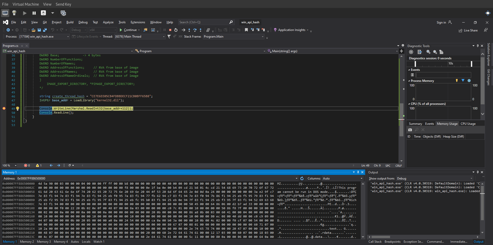
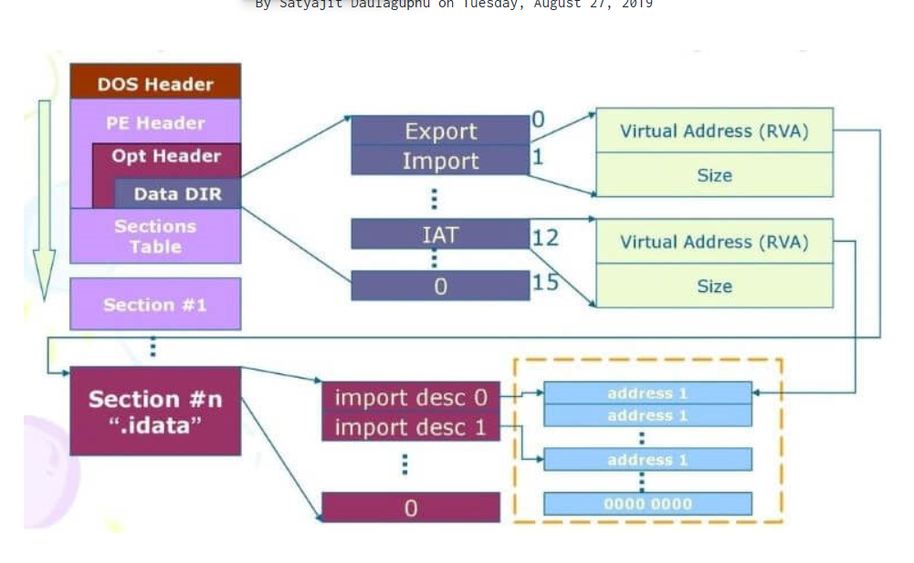

# Windows API Hashing - Part 2

Here we are gonna analyse the entry point and learn about the structure of DLL so that we can know how to jump to `.edata` segment. As shown in the image the entry address is `0x00007ff886500000`

So basically Structure = DOS Header + DOS Stub + PE File header(249 bytes) + Section Table  + Dictionary + Sections

Observations

- The first two bytes of DLL are pointing to MZ which is the magic byte for DOS. Hence this proves our entry point is correct.
- Now the DOS header is of 64 bytes so at offset of 64 bytes to entry point we will find `e_lfanew` which is a 4 byte offset and tells where the PE header is located. For us this value is `f8 00 00 00` ( Just count 64 bytes and the last 4 bytes are the e_lfanew )
- Now add `0x000000f8` with `0x00007ff886500000` to get the entry point of PE file header. The magic bytes for PE file header are `50 45 00 00` and if your addtion points to the above bytes then you can continue. ( Reversed due to little-endian)
- So basically PE file header is at `0x00007FF8865000F8`

Now PE File header contains Signature, IMAGE_FILE_HEADER and IMAGE_OPTIONAL_HEADER
- We already saw the signature i.e `50 45 00 00`
- The next field i.e IMAGE_FILE_HEADER is 20 bytes long
- Now just after 24 bytes starts the IMAGE_OPTIONAL_HEADER which is very important field.

## IMAGE_OPTIONAL_HEADER (Size - 

- First byte of IMAGE_OPTIONAL_HEADER tells if the PE is 32 bit or 64 bit. So if the 24th byte is `0x20` then its a 64 bit and if its `0x10` then its a 32 bit. In our case its `0x20` which means the file is 64 bit dll.

# Failed! 

After trying hard to read memory properly via structre I just found it very difficult to manipulate memory in C# . And indeed after taking with Morten, he quoted "In C/C++ its easy to manipulate memory, where sorting/parsing is easier in C# - that more or less the whole idea of low level vs high level languages" which makes sense. C# is a high level language and low level operations like memory manipulation are just very difficult in C#. So after this I decided to write a DLL in C++ which will perform the memory manipulation and expose the method to use it in C# via p/invoke.

