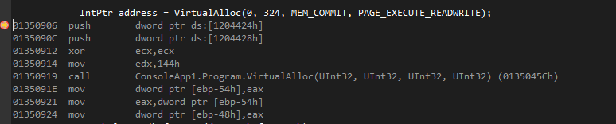

# Hooked Syscalls

AV softwares generally hook syscalls to identify the arguments being passed to the function. So basically these AV insert a `jmp` instruction to hijack function execution and the analyse the arguments being passed to functions.

## How do we confirm this?

After disassembling the the method VirtualAlloc it can be seen that the function is not hooked by default by defender.

And in case if you see a `jmp` instruction then it means the function is hooked!

