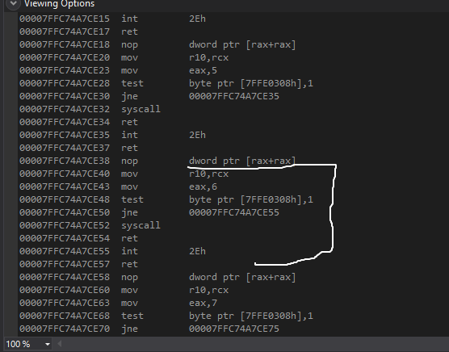

# A Practial example

So we know that all the methods (The native api ones) begin with `Nt` and those methods are present in ntdll.dll. Hence we need to look into the assembly instructions for any specific method. For instance lets consider `NtReadFile`

I came to know that NtReadFile exists in Native API by going to google project zero which lays down all the syscall number for each api [here](https://j00ru.vexillium.org/syscalls/nt/64/)

So lets setup a cpp file to poke around `NtReadFile`
```c++
#include <iostream>
#include<Windows.h>
#include "winternl.h"

#pragma comment(lib, "ntdll")


int main() {
	FARPROC addr = GetProcAddress(LoadLibraryA("ntdll"), "NtReadFile");
	return 0;
}
```

We set breakpoint at return 0 to read assembly instructions on address addr.


This tells us the following asm code for NtReadFile

```asm
00007FFC74A7CE40  mov         r10,rcx  
00007FFC74A7CE43  mov         eax,6  
00007FFC74A7CE48  test        byte ptr [7FFE0308h],1  
00007FFC74A7CE50  jne         00007FFC74A7CE55  
00007FFC74A7CE52  syscall  
00007FFC74A7CE54  ret  
00007FFC74A7CE55  int         2Eh
```
So basically the `int 2Eh` is `int 0x80` equivalent for windows. This instruction tells to program to talk with kernel i.e ring 0. 
We save rcx into r10 and assign eax to 6 ( eax should point to syscall number i.e 6 here) and the jump to `int 2Eh` instruction is the test becomes false. So we can replicate this to create our own code by just using the asm and completly avoiding `ReadFile` method.

Code:
Asm file can be found [here](../code/day22.asm)
Cpp file can be found [here](../code/day22.cpp)


So apparantly after reading [this](https://reverseengineering.stackexchange.com/questions/19333/what-are-the-difference-syscall-and-int-0x2e-instructions) thread `int 2eH` has been replaced by `syscall` in windows 8 and above in name of Virtualization Based Security
