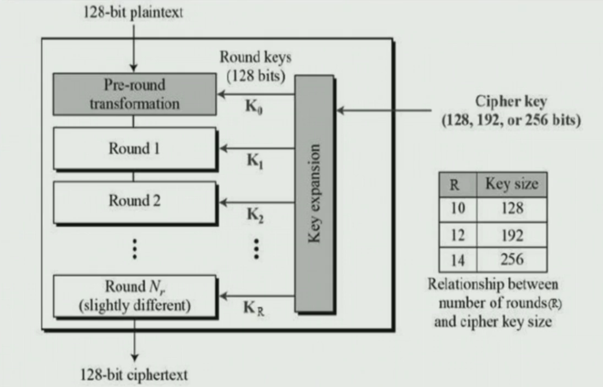
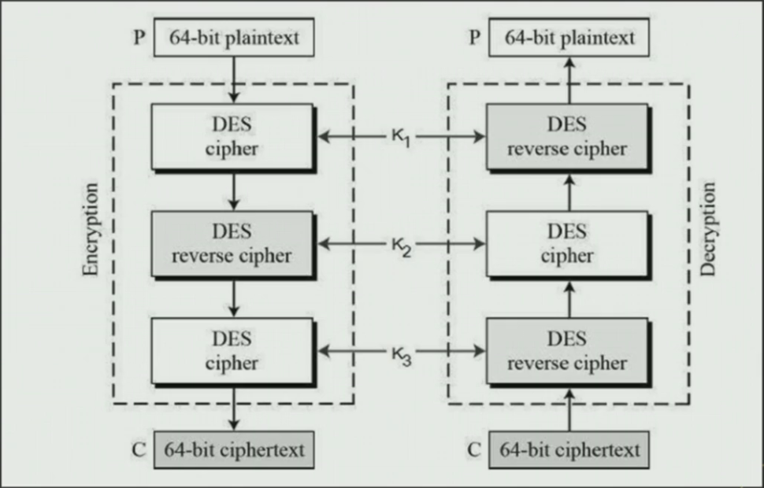
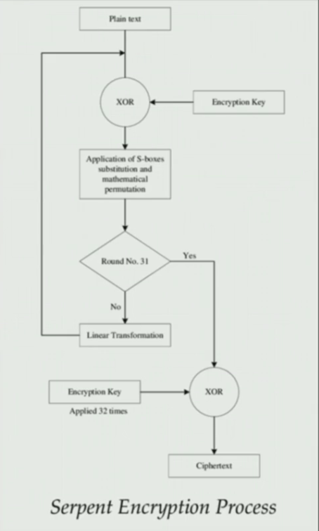
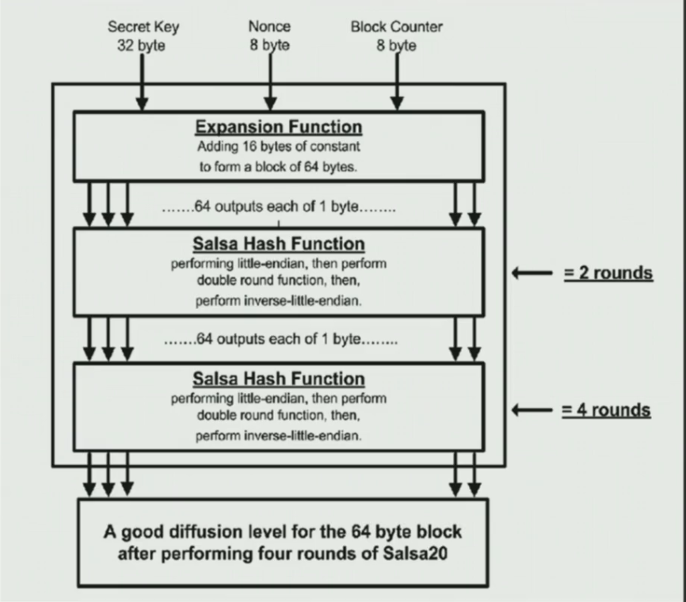

# Algorithms : Encryption

Symmetric Encryption Algorithms

Common 
- RC4
- AES
- 3DES
- Serpent

Exotic
- Salsa20
- Misty-1

Asymmetric Encryption Algorithms

Common
- RSA

Exotic
- ECDH (Elleptic Curve Deffie Hellman)

How to identify Encryption in Malwares?
- Look out for WinAPI and API methods used by the malware in IAT to know if its using any sort of encryption/decpryption
- Methods to look for : `CryptCreateHash`,`CryptEncrypt/Decrypt`,`CryptGenKey`
- Remeber that generally usage of WinAPI would be obfuscated in many ways.

Some polular methods

```c++
BOOL CryptEncrypt(
	HCRYPTKEY kHey,
	HCRYPTHASH hHash,
	BOOL Final,
	DWORD dwFlags,
	BYTE *pbData,
	DWORD *pdwDataLen,
	DWORD dwBufLen
);
```
Looking at some other function like CryptGenKey and CryptCreateHash we see a ALG_ID parameter which can be used to indicate the algorithm used for encryption.
```c++
BOOL CryptGenKey(
	HCRYPTPROV hProv,
	ALG_ID	Algid,
	DWORD dwFlags,
	HCRYPTKEY *phKey
);
```
```c++
BOOL CryptCreateHash(
	HCRYPTPROV hProv,
	ALG_ID Algid,
	HCRYPTKEY hKey,
	DWORD	dwFlags,
	HCRYPTHASH *phHash
);
```
Algid can be used to know the alogrithm used.

### Detect without API
- Tools like `KANAL` automate process of detecting algorithms using constants. Basically constants are hardcoded values required in order to output the correct-data which are easy to detect. They can be substitution number,magic numbers or even just certain values used for mathematical operations. 
- Another way is detecting the flow of algorithm. For instnace you should know how the RC4 algorithm work and if you encounter a similar flow in malware then it uses RC4.

Case study for RC4

RC4 generate a pseudorandom stream of bits which are then used to xor with plaintext to get cipher text. To generate pseuorandom stream it uses permutation of all 256 bytes made using KSA and then stream of bits are generated using PRGA (Pseudo-random generation algorithm)

KSA
```c++
for(int i=0;i<256;i++)
	S[i]=i;
int j=0;
for(int i=0;i<256;i++){
	j=(j+S[i]+key[i%keylen])%256;
	swap(S[i],S[j]);
```
Key is the secret key which is initailized by user.
PRGA
```text
i=0;
j=0;
while GeneratingOutput:
	i = (i+1)%256
	j = (j+S[i])%256
	swap(S[i],S[j])
	K = S[(S[i]+S[j])%256]
return K
```
Then K is xored with plaintext to get cipher text.

So to identify KSA whenver you see a iteration happening and value itself is getting comapred with 256 then its KSA and once KSA is there then its RC4.

Similary AES


Similarly 3DES (Uses 3 keys)


Serpent Encryption 


Salsa Encprytion

