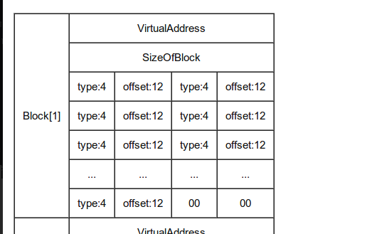

# Reflected DLL Injection - Part 3

Things to know
- VirtualAddress is the RVA to where loader should map the section. So when you want to get address to section always add VirtualAddress with base address.
- PointerToRawData is the file based offset where the raw data emitted by compiler is kept. So whenever you want to extract the bytes in section always add PointerToRawData with the base address.
- IAT table works either by using ordinal of method or by using name. So make sure you take care of both the things.
- We open a handle to another process and try allocating memory inside that process and then copy the DLL and update sections,.realloc and IAT table and finally execute the memory section.
- By default the dll generated by msfvenom doesnt have a `.realloc` section.

This is how the realloc section looks like

Code can be found [here](../code/day30.cpp)

The code is not working and needs more debugging. So thats gonna be for next day.
