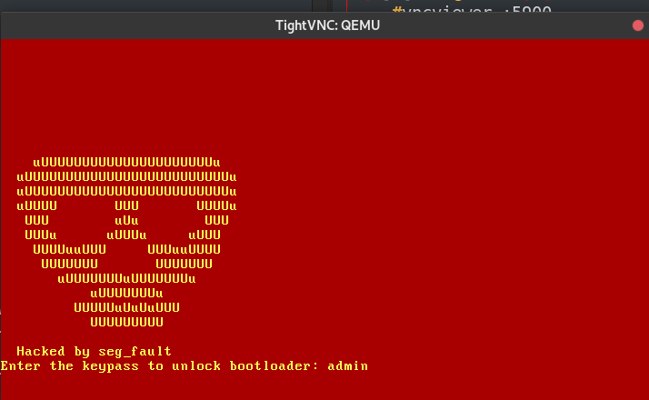

# Getting stuck in infinite boot - Writing BootLoader


## What happends when you power on?

- Electric current flows from PSU to motherboard that supplies current to other parts of PC.
- Then BIOS does POST(Power-On Self Test) where it bridges all parts of PC and interface as required. (eg: initializing memory,giving CPU access to hardware)
- Then it reaches booting stage of PC and passes control to “drive 0” of PC size being 512 bytes.
- These 512 bytes are called MBR which tells CPU which OS to run.
- Bootloader from MBR is selected and then executed to boot up the OS.

> Btw : Linux has a boot load manager called GRUB that writes into MBR and redirect code flow to 2nd stage loader in GRUB.  

## Bootloader facts!

- Loaded into RAM after POST (Power-On Self Test)
- BootLoader works in 16 bit mode.
- Size limit of 512 bytes.
- BIOS goes via all available HDD,SSD and checks if the first 512 bytes to find if bootable.
> First those 512 bytes are taken and saved in 0x7c00 address.
> Magic Byte 0xaa55 as last 2 bytes of 512 bytes to indicate bootable OS
- Once bootloader found execution flow changed shifted to 0x7c00.


Code can be found [here](../code/day31.asm)

Compile it using nasm
```
nasm -f bin file.asm -o bootloader.bin
```

And finally run it using qemu
```
qemu-system-x86_64 -drive format=raw,file=bootloader.bin 
```

The output




## Reference
As usual [ired team](https://www.ired.team/miscellaneous-reversing-forensics/windows-kernel-internals/writing-a-custom-bootloader) is the best!
