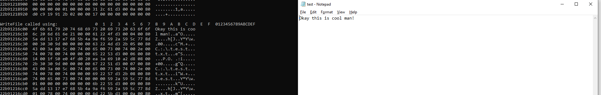

# Playing with Frida Part 1

## Reading Notepad Content writtent to Disk.

- It is possible to save characters typed into a process using frida by hooking inside the process and dumping the arguments passed to `WriteFile`

Now let's first prepare a hook.js for our frida.

```js
var writeFile = Module.getExportByName(null,"WriteFile");

Interceptor.attach(writeFile,{
	onEnter: function(args)
	{
		console.log("WriteFile called using: "+hexdump(args[1])+"\n");
	}
});
```

Once done start up frida and load the script using
```text
frida C:\Windows\System32\notepad.exe -l hook.js
```

Once thats done type in `%resume` to resume the application and write any text and save it and you will see frida capturing the information written to disk. A very cool mind blown thing here.



## Printing Modules loaded by process

Code can be found [here](../code/day34_1.py)

This would list out all the modules loaded by the process.

## Taking a step further?

Code [here](../code/day34.py) would list out all the import from the modules used by process, but it throws error saying `TransportError: Connection is closed` so its eiter a bug in frida or I need to look into my code. 


# References
As usual one and only [ired team](https://www.ired.team/miscellaneous-reversing-forensics/windows-kernel-internals/instrumenting-windows-apis-with-frida) is the best
