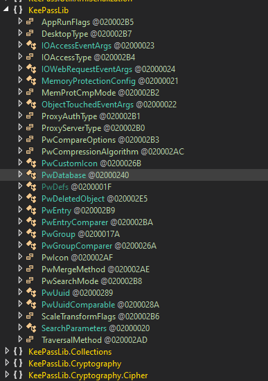

# Blue Screen of Death in Windows

- We need `SeShutdownPrivilege` enabled to trigger the BSOD
- Then call `NtRaiseHardError` to trigger BSOD.

## Note:
`NtRaiseHardError` is a undocumented function present in ntdll.dll. Information can be found [here](http://undocumented.ntinternals.net/index.html?page=UserMode%2FUndocumented%20Functions%2FError%2FNtRaiseHardError.html)

Code can be found [here](../code/day37.cpp)
And here is the pic of BSOD

